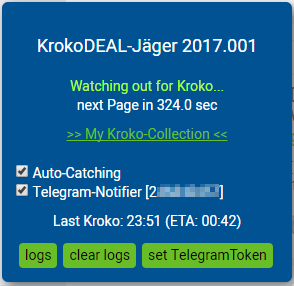

# krokodeal-2016
Krokodeal hunt script for Tampermonkey.
*Also works for ~~2017~~ 2018 !*

#### This is an experimental script for educational purposes only.

- tested on Chrome v68

### First Steps

1. Install [Tampermonkey](https://chrome.google.com/webstore/detail/tampermonkey/dhdgffkkebhmkfjojejmpbldmpobfkfo)
2. Click the link to [raw Krokodeal.user.js](https://github.com/monoxacc/krokodeal-2016/raw/master/Krokodeal.user.js)
3. Tampermonkey asks to install script
4. Navigate to a deal page
5. Chill and wait - one tab is enough, there is no benefit by using more than one browser tab

### Telegram Notifier

1. Create a telegram bot at [BotFather](https://telegram.me/BotFather)
2. Set Telegram token
3. Check the Telegram-Notify option and send captcha to your telegram bot
4. Get notified!

### Hints

- To prevent that the bot will stuck (e.g. caused by internet connection errors like timeout/server unreachable) you can use [AutoRefresh](https://chrome.google.com/webstore/detail/auto-refresh/ifooldnmmcmlbdennkpdnlnbgbmfalko) with 30 or 45min configured.

*Thanks to the following persons for distributing their software for free:*
- Anthony Lieuallen
  - [grant-none-shim.js](https://gist.githubusercontent.com/arantius/3123124/raw/grant-none-shim.js)
